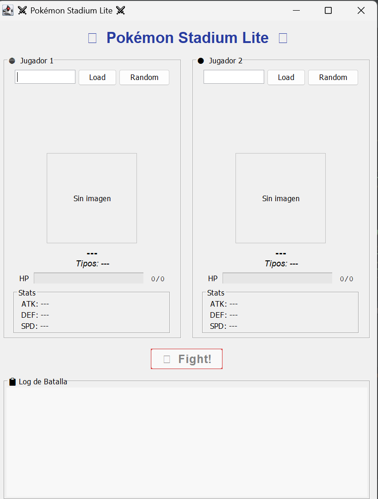
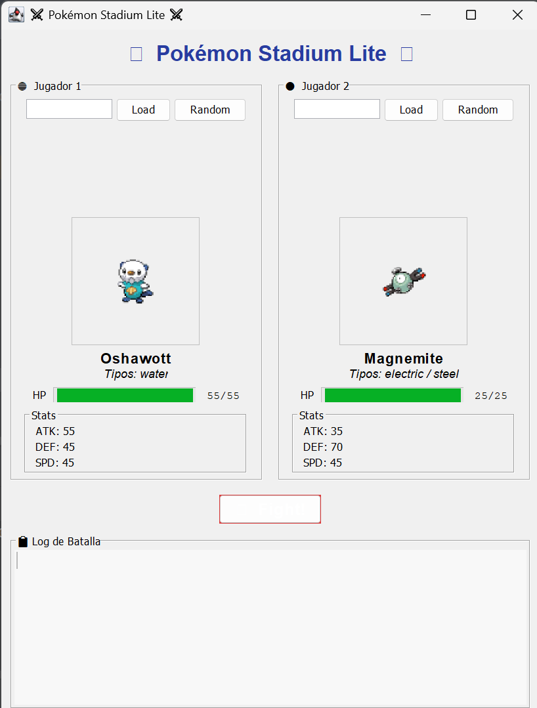
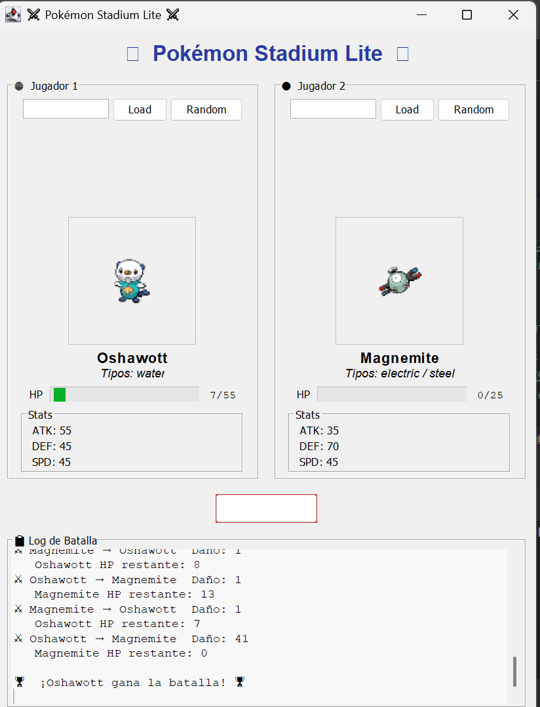

# Pokémon Stadium Lite

**Diego Andres Bolaños**
**2379918**

Mini-aplicación de escritorio en Java Swing que simula un combate estilo **Pokémon Stadium** entre dos Pokémon obtenidos en vivo desde [PokeAPI](https://pokeapi.co/).

---

## Instrucciones de ejecución

### Prerrequisitos
- **Java 11+**
- **IntelliJ IDEA** (el proyecto ya incluye `.iml` y configuración de librería)
- La librería `json-20230227.jar` ya está en `/lib` y declarada en `.idea/libraries/`

### Pasos
1. Abre el proyecto en IntelliJ IDEA (`File > Open` → carpeta raíz).
2. Verifica que `json-20230227.jar` esté marcada como dependencia (`File > Project Structure > Libraries`).
3. Ejecuta la clase **`ui.BattleGUI`** (clic derecho → *Run*).

---

## Diseño de la aplicación

### Arquitectura en paquetes

```
src/
├── model/
│   └── Pokemon.java          — Modelo de datos (stats, tipos, HP actual)
├── api/
│   └── PokeApiClient.java    — Consulta REST + parseo JSON
├── battle/
│   ├── BattleListener.java   — Interface de eventos (Observer)
│   └── Battle.java           — Lógica del combate por turnos
└── ui/
    ├── PokemonPanel.java     — Panel visual por jugador
    └── BattleGUI.java        — Ventana principal (implementa BattleListener)
```

### Decisiones de diseño

**Separación de responsabilidades**: La clase `Battle` contiene exclusivamente la lógica del combate y no sabe nada de la UI. Se comunica hacia afuera únicamente a través de la interface `BattleListener`, que implementa `BattleGUI`. Esto permite probar la lógica de combate de forma independiente.

**Concurrencia no bloqueante**: Todas las peticiones HTTP a PokeAPI se realizan dentro de `SwingWorker.doInBackground()`, garantizando que el hilo de la UI (EDT) nunca se bloquee. Los eventos del combate (`onTurn`, `onHpChanged`, `onBattleEnded`) se despachan al EDT usando `SwingUtilities.invokeLater()`.

### Fórmula de daño

```
damage = ATK_atacante × rand(0..1) − DEF_defensor × rand(0..1)
```
- Mínimo garantizado: **1 punto** de daño por turno.
- **Crítico** (probabilidad 10 %): multiplicador × 1.5.
- **Efectividad de tipo** (primer tipo de cada Pokémon):
  - Agua > Fuego | Fuego > Planta | Planta > Agua → × 1.3
  - Inversa → × 0.7 | Resto → × 1.0

### Orden de turnos
El Pokémon con mayor **Speed** ataca primero. En caso de empate, el orden se decide aleatoriamente.

---

## Capturas de pantalla

<p align="center">
 
  
   
  
 
  
</p>

---

